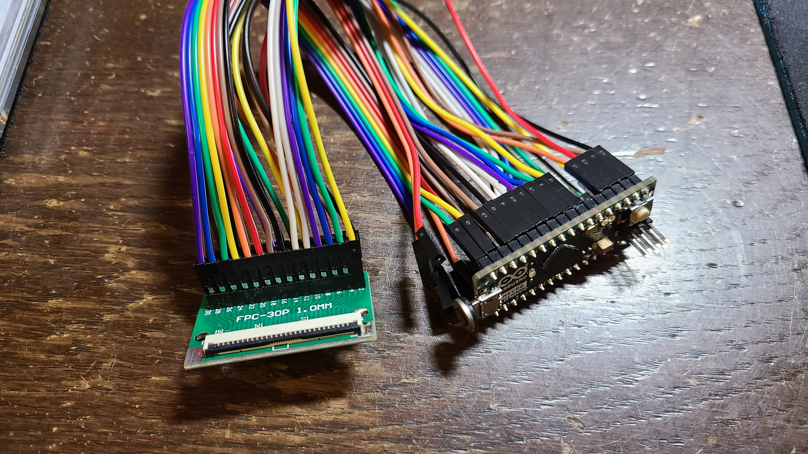

# Laptopkeyboard_Controller
Laptop keyboard Contoller

# Requirements

**Arduino IDE**

***Libraries:***
* [HID-Project](https://github.com/NicoHood/HID/)

**Micro computer with USB HID**

***ex:***
* Arduino Leonardo
* Arduino Micro (pro micro)

**Adapter for connect Arduino and laptop Keyboard**

Many laptop keyboard have FFC(Flat Flexible Cable). 
And you need adapter for FFC to Arduino pins.
You need make that as you need.

Like this!↓

